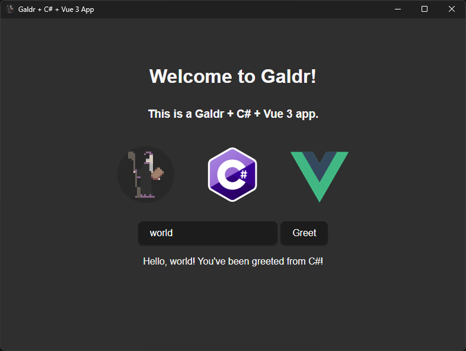

## Galdr

Galdr is a WIP framework for building multi-platform desktop applications using C#. It's powered by [webview](https://github.com/webview/webview) and compatible with any frontend web framework of your choice.

Features:
* Cross-platform (Windows, Linux, macOS)
* Call C# methods asynchronously from javascript/typescript
* Compatible with any frontend framework (Vue, React, etc.)
* Hot-reload
* Native file system integration
* Single file executable
* Reasonable binary size (example is 23.7MB)
* Dependency injection



## POC

The POC is a simple app using Vue with just one component. The setup is pretty straight forward, just make a Vue app like you normally would and then setup Galdr with services and commands.

```cs
internal class Program
{
    [STAThread]
    static void Main(string[] args)
    {
        using Galdr.Galdr galdr = new GaldrBuilder()
            .SetTitle("Galdr + C# + Vue 3 App")
            .SetSize(1024, 768)
            .SetMinSize(800, 600)
            .AddSingleton<SingletonTest>()
            .AddService<TransientTest>()
            .AddService<CommandsTest>()
            .SetCommandNamespace("commands")
            .SetPort(42069)
            .Build();

        galdr.Run();
    }
}
```

Any class tagged with the `[Command]` attribute in the configured command namespace will automatically be detected and added for use on the frontend. The attribute optionally takes in a command name (it uses the method name by default).

```cs
[Command]
public async Task<string> TestAsync()
{
    await Task.Delay(5000);
    return "it worked async";
}
```

Then you can use the command anywhere on the frontend with `galdrInvoke`. The command names are made camelCase in `js`.

```js
galdrInvoke("testAsync")
    .then(a => console.log(a))
    .catch(e => console.error(e));
```

Any additional parameters can be added to the `galdrInvoke` call after the command name. The parameters will automatically be deserialized and passed into the C# method. Any additional parameters not passed in by the frontend will be evaluated via dependency injection. The command's class can also contain dependencies in the constructor.

```js
galdrInvoke("testSync", { someProp: 'value' })
    .then(a => console.log(a))
    .catch(e => console.error(e));
```

## Debugging

To debug the application open a terminal and start the server. Make sure you're in the GaldrTest project directory.

```
npm install
npm run dev
```

Then just hit `F5` and you can start and debug the application like normal.

## Building

The frontend is served from the files embedded into the assembly on build, so the first step is to build the frontend. Make sure you're in the GaldrTest project directory.

```
npm install
npm run build
```

Then you can build the app as a single file using `dotnet publish` - just be sure to update to the platform.

```
dotnet publish -c Release -r win-x64 --self-contained true -p:PublishSingleFile=true -p:IncludeNativeLibrariesForSelfExtract=true -p:PublishTrimmed=True -p:TrimMode=link
```
